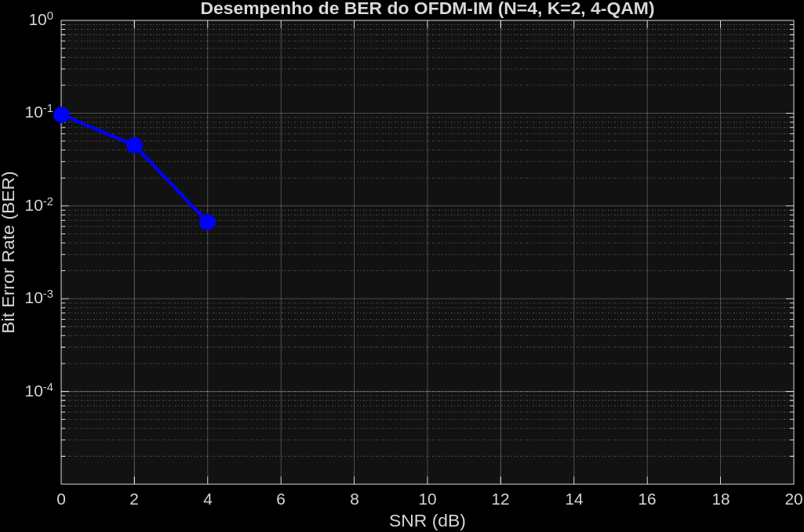
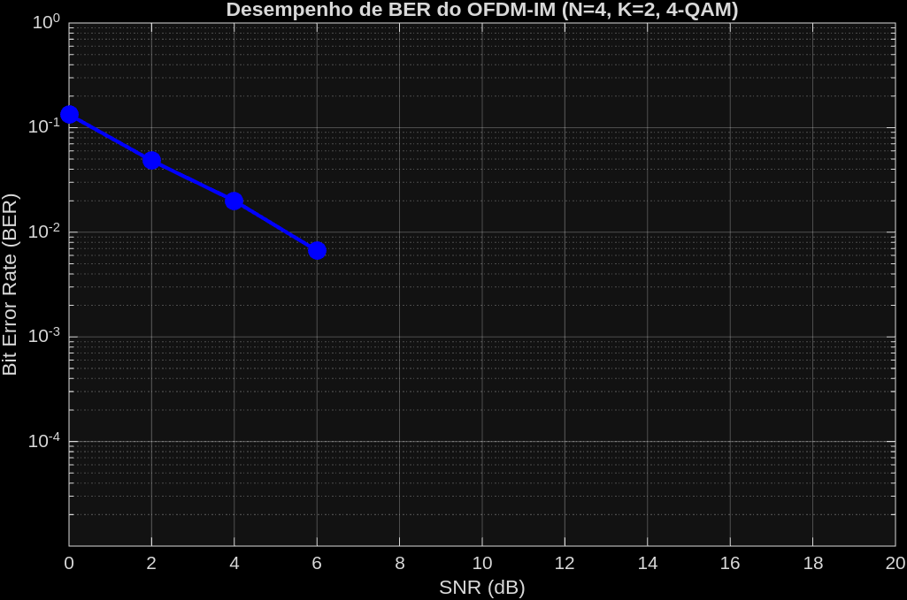
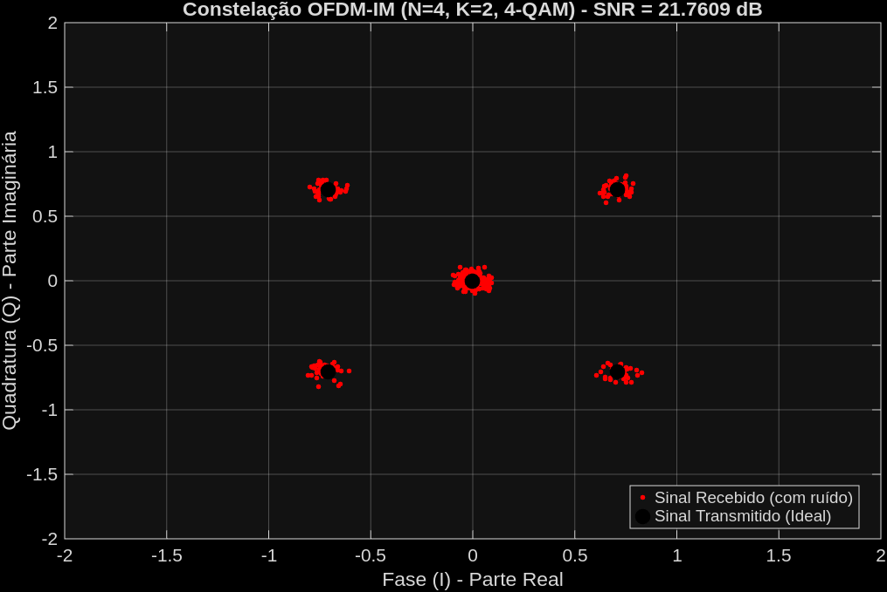
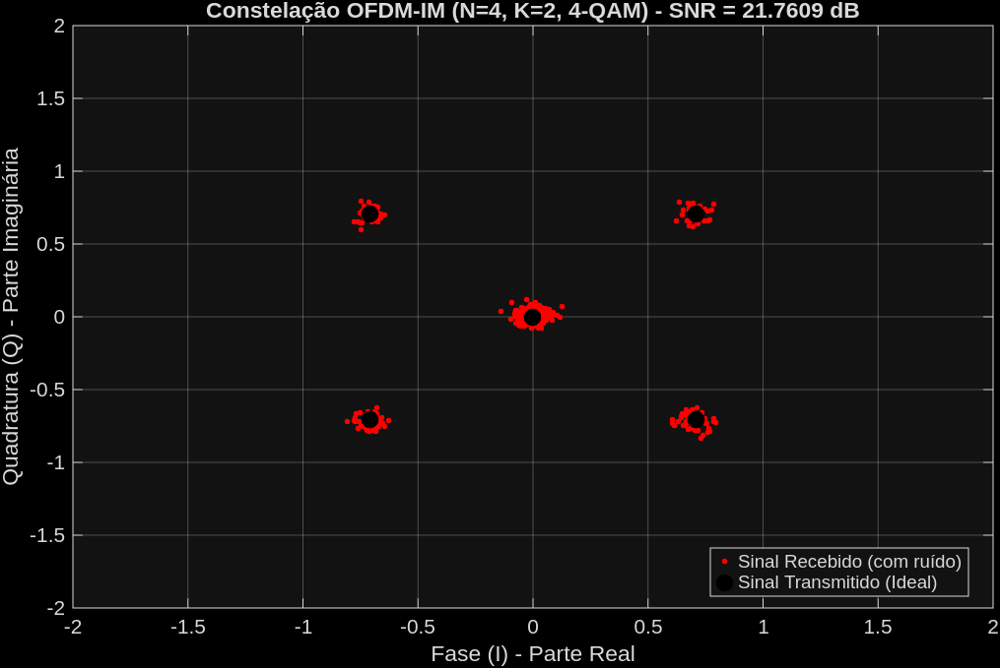
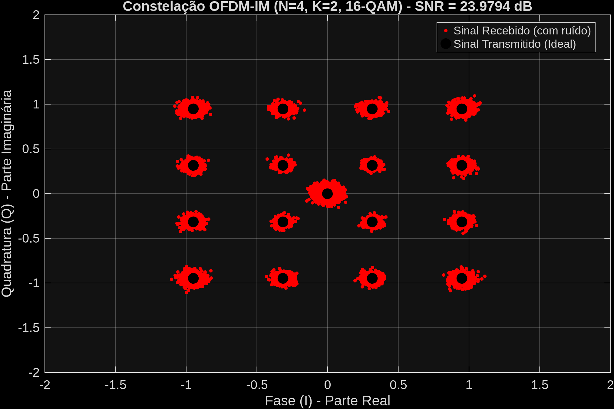
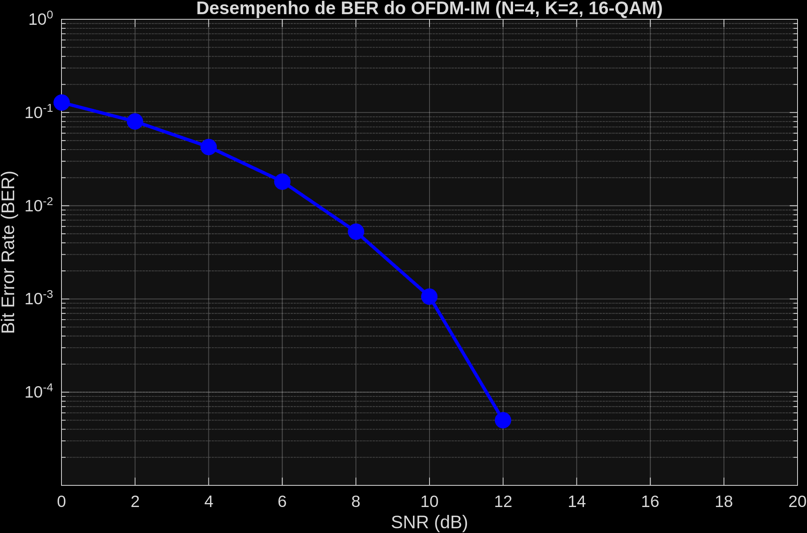
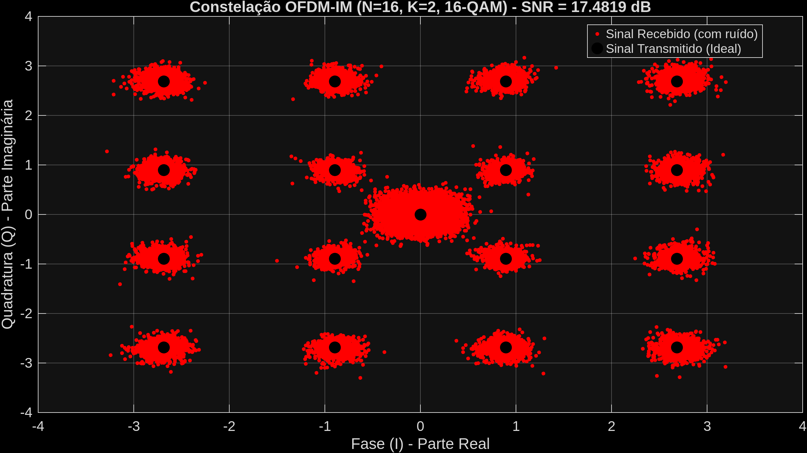
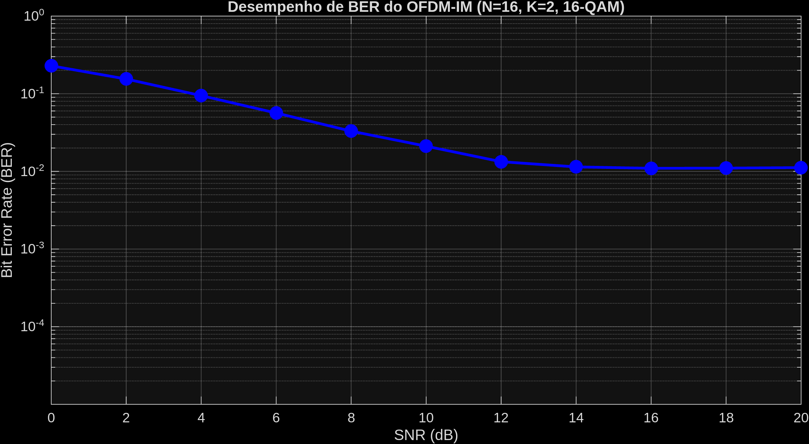
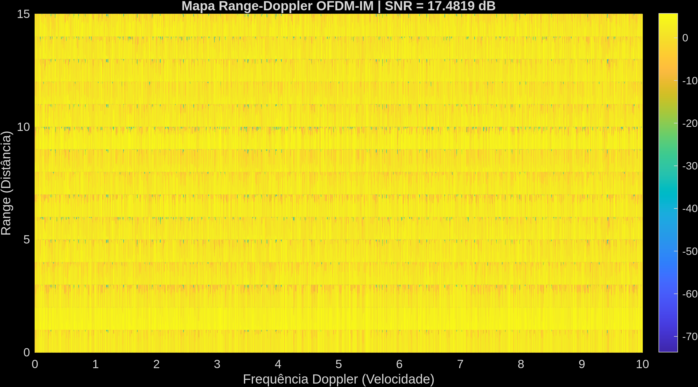

|BER com prefixo cíclico|BER sem prefixo cíclico|
:-----------------------------------------------------------------------------------------:|:------------------------:
||

|Constelação com prefixo cíclico| Constelação sem prefixo cíclico
:-------------------------------:|:-------------------------------:
|||

|Constelação com prefixo cíclico e limitações de hardware| BER com prefixo cíclico e limitações de hardware|
:-------------------------------:|:-------------------------------:
|||

                                    =====Sensoriamento com imperfeições=====

|Constelação OFDM-IM| Curva de BER |
:-------------------------------:|:-------------------------------:
|||

|Mapa Range Doppler (Distância real: 1M / Velocidade real: 1 M/s)|
|:-------------------------------:|
||

