# Resultados de Simulação - OFDM-IM e Sensoriamento

Nos resultados abaixo, foi considerado um alvo localizado a 15 célular com uma velocidade de 10 células.

Cada célula de resolução equivale a um $\Delta R $

sendo $\Delta R = \frac{c}{2B}$.

Como utilizou-se uma largura de banda de 20*10^6, logo $\Delta R = 7,5 m$
### Caso Ideal (CFO Compensado)

| Constelação | BER | Range Doppler |
| :---: | :---: | :---: |
| 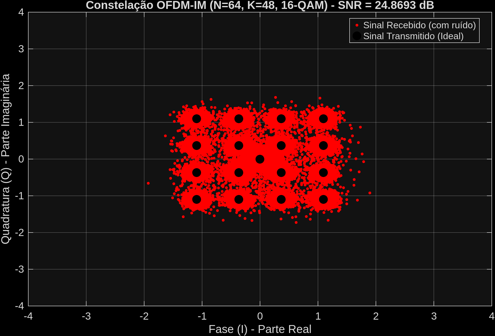 | 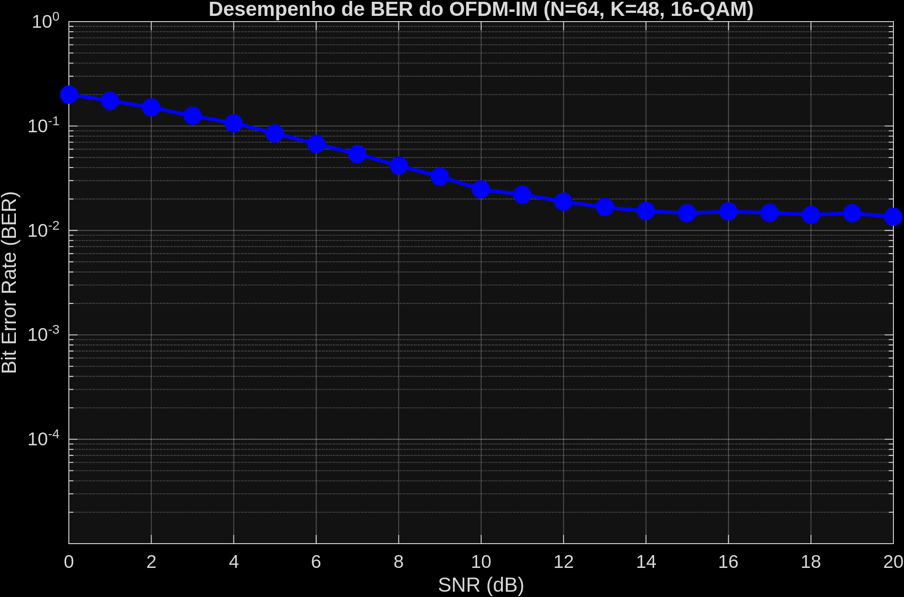 | 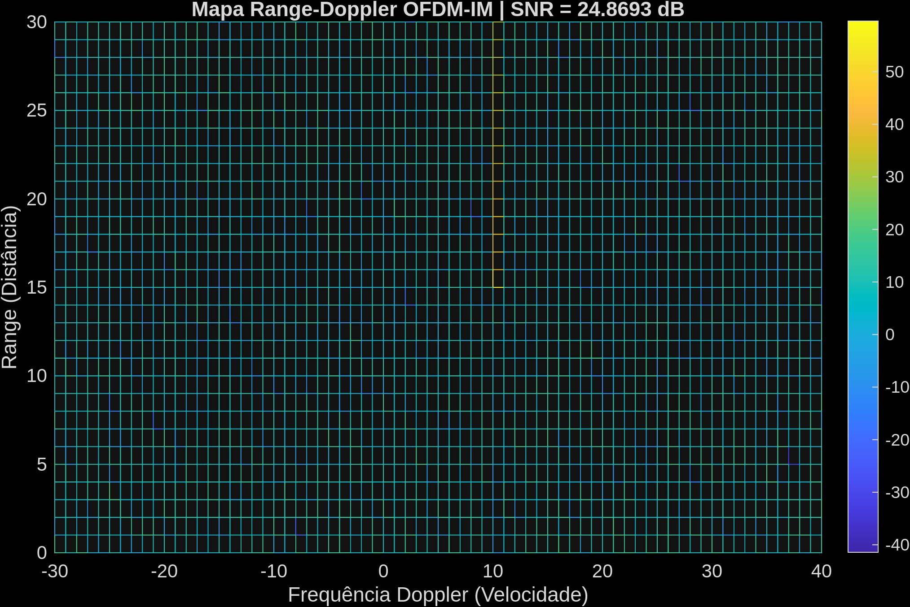 |

### Com Limitação de Banda (BW)

| Constelação | BER | Range Doppler |
| :---: | :---: | :---: |
|  | 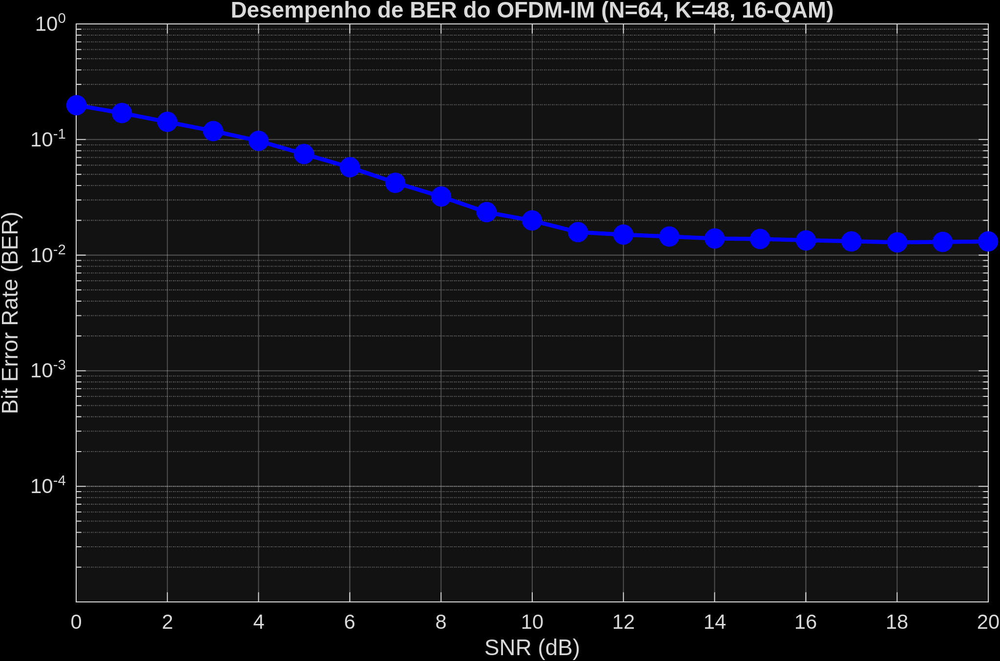 | 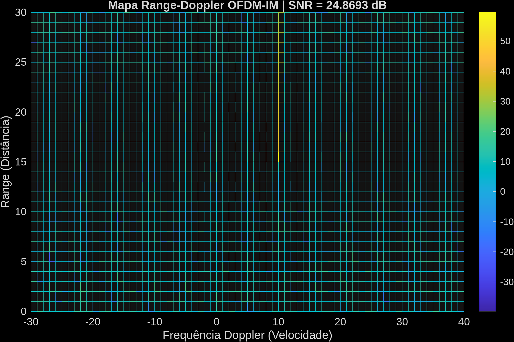 |

### Com Limitação de Quantização

| Constelação | BER | Range Doppler |
| :---: | :---: | :---: |
| 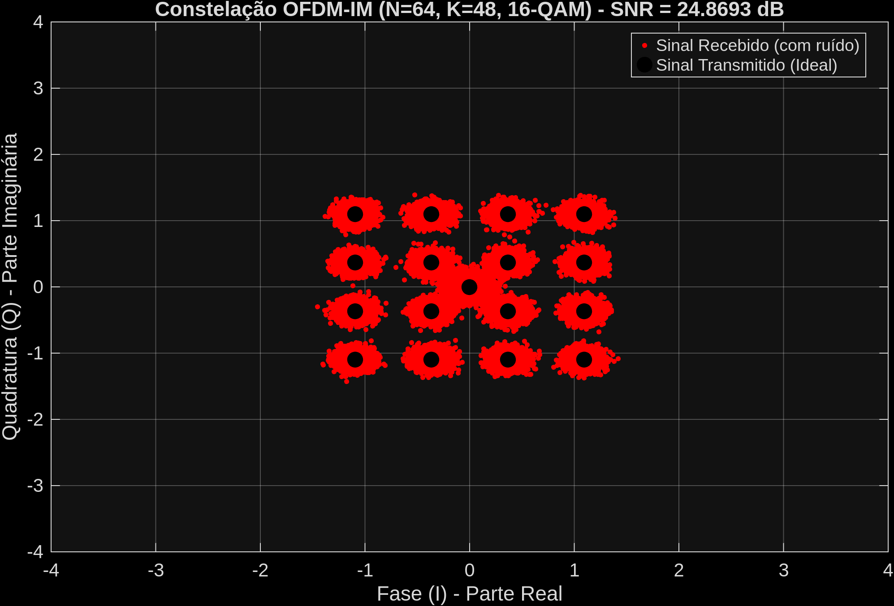 | 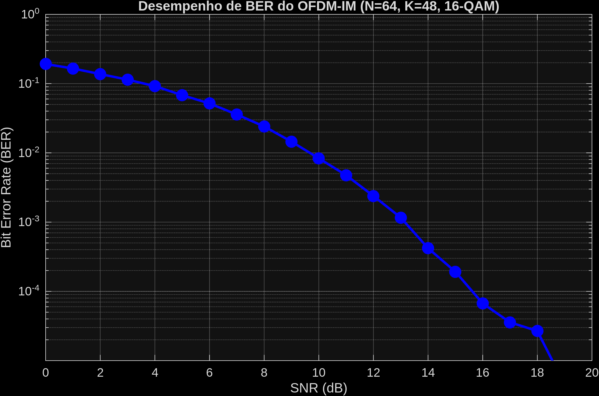 | 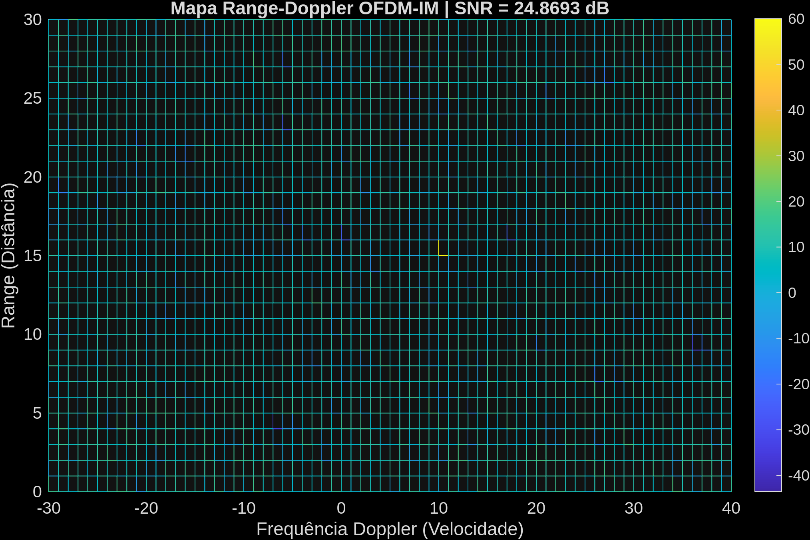 |

### Com Erro de Frequência (CFO)

| Constelação | BER | Range Doppler |
| :---: | :---: | :---: |
| 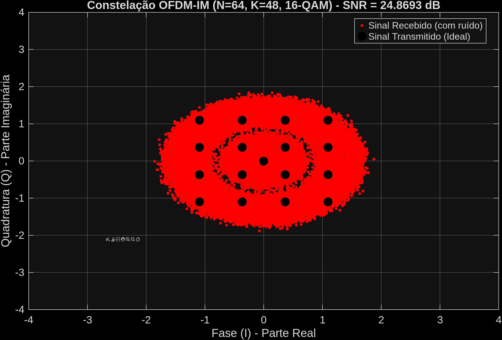 | 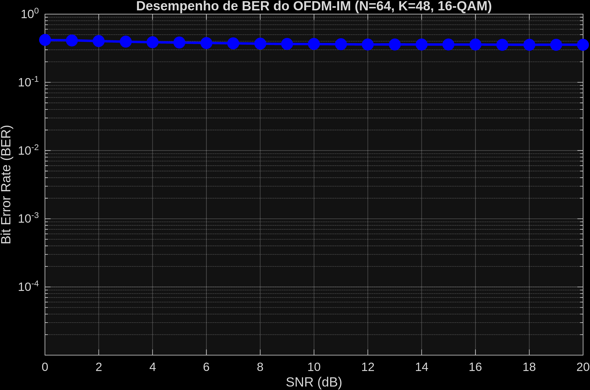 | 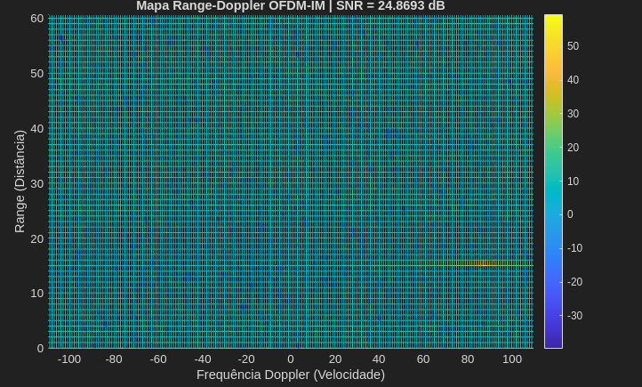 |
